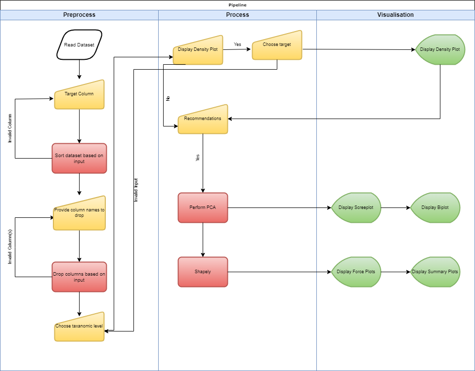

# Integrated-omics

TODO:
- Example of codes which I used
- Explain pipeline
- Explain how i preprocessed data

# Pipeline
A schematic overview can be seen in figure 1. The yellow symbol indicates user input, the red square indicates a process that is performed by the application, and the green symbol indicates visualization.

The pipeline works as follows:
1. Read the dataset and define a target column, *y*.
2. Drop feature columns if specified.
3. Choose taxanomy, such as *species*.
4. Perform PCA.
5. Perform shapely.
6. Display plots to user.

The user can interpret the plots and find the features that contribute most

# Preprocess
The data is preprocessed by using PCA. PCA is a dimensionality reduction technique that tries to explain most variance. 

# Code
## PCA
